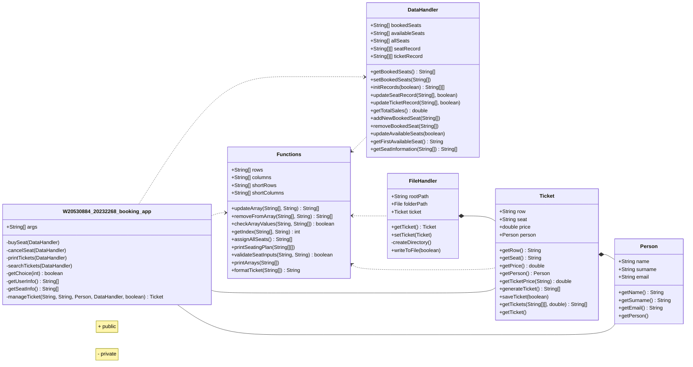

### Booking App (SD-02) `coursework`  

---

#### Note

- As per the rules of coursework no dynamic arrays or any external
packages were used.

- Only some of the basic data types were used:
    - char
    - double
    - boolean
    - int
    - String
    - String[]
    - String[][]

---

#### Class diagram representation of the booking app

---

